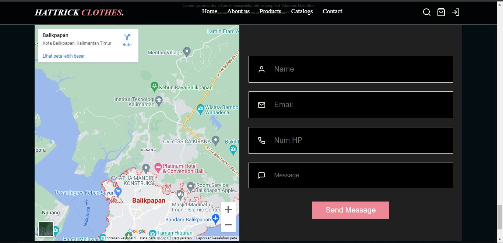
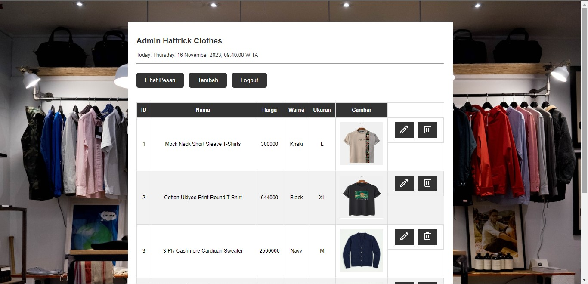
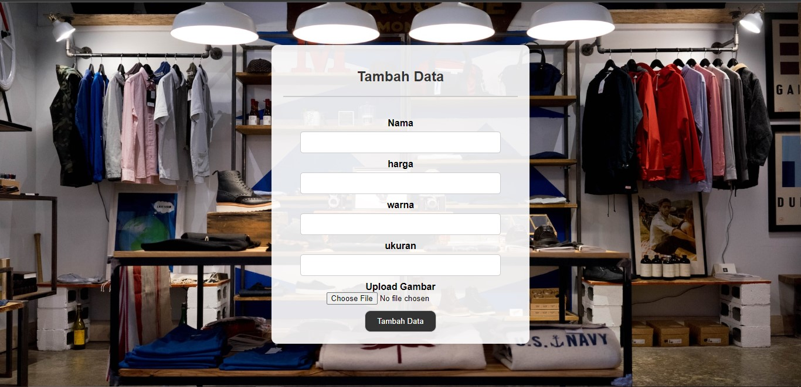

# PROJEK AKHIR PEMROGRAMAN WEB

- Judul Program : [Toko Pakaian / Hattrick Clothes](https://www.google.com)
- Anggota Kelompok :
  - Ahmad Nur Fauzan / 2209106057(Ketua)
  - Umar Farauk Eka Putra / 2209106058
  - Abdullah Azam / 2209106056

## Tutorial penggunaan Website
cara penggunaan website
1. [Untuk User](#user)
2. [Untuk Admin](#admin)

## User
### 1. Registrasi
Untuk melakukan registrasi bisa mengklik tombol  yang tersedia di bagian atas sebelah kanan website.  
Maka akan tampil halaman Registrasi seperti berikut : 
 
Setelah itu silahkan mengisi Username dan Password untuk melakukan registrasi.  
Lalu tekan tombol Register untuk melakukan Registrasi.

### 2. Login
Untuk melakukan Login bisa mengklik tombol  yang tersedia di bagian atas sebelah kanan website.  
Di halaman registrasi klik tombol  maka akan berpindah ke halaman Login seperti berikut : 
  
Setelah itu login dengan username dan password anda. 
Lalu tekan tombol Login untuk melakukan Login.

### 3. Mengirim Pesan Ke Admin
Untuk mengirim pesan ke admin silahkan scroll halaman website sampai pada bagian berikut : 
  
Setelah itu silahkan mengisi Nama, Email, Nomor HP, dan tuliskan pesan yang akan di sampaikan.  
Lalu tekan tombol Send Message untuk mengirimkan pesan.

## Admin
### 1. Login Admin
Untuk melakukan Login bisa mengklik tombol  yang tersedia di bagian atas sebelah kanan website.  
Di halaman registrasi klik tombol  maka akan berpindah ke halaman Login seperti berikut : 
  
Setelah itu login dengan username **admin** dan password **admin**.  
Lalu tekan tombol Login untuk melakukan Login.

### 2. Menu CRUD Barang
Setelah berhasil Login maka admin akan diarahkan ke halaman dashboard seperti berikut :  

Pada halaman ini admin bisa melakukan CRUD barang.

### 3. Tambah Barang
Untuk menambah barang silahkan klik tombol Tambah. Maka akan muncul halaman Tambah Barang seperti berikut :  
  
Selanjutnya silahkan masukkan Data Barang yang ingin di tambahkan.  
> [!NOTE]
> 1. Harga barang Tidak bisa < Rp 10.000  
> 2. Hanya File Gambar yang dapat di Upload.

Jika sudah klik tombol Tambah Data untuk menambahkan barang.